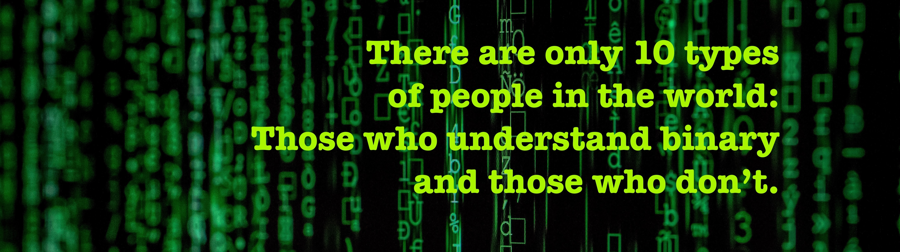

<h1 align="center"> Hi 👋, I'm Yunus YILDIZ </h1>
<h3 align="center"> A Passionate Full-Stack Developer from Switzerland</h3>

---

  

  🧑‍💻 

<pre> Always learning. Always building. 
I enjoy transforming ideas into digital experiences.  
Passionate about solving real-world challenges through technology.
I thrive in dynamic teams, creating impactful, scalable applications.</pre>

### 📫 Connect With Me

  
  
  
   
  
  
  

  

---

### 🔄 Now

- 🎓 Powercoders Bootcamp – ICT Work Integration Program, Bern (graduate) 
- 💼 Full Stack Developer Intern at TotalEnergies
- 🚀 Working on: Enterprise Internal Projects
- 📖 Improving Advanced React, Redux Toolkit, MERN stack, Python & Swagger UI - API Documentation Tool 

---

### 📊 GitHub Stats

  

    
    
  

  

    
  

---

### 🧰 Tech Stack  
> Tools, languages, and frameworks I use regularly  

<!-- 🧠 Skill Icons -->
 
<!-- 🏷️ Badges -->

### 💡 Projects Spotlight

- 🏟️ [`OpenArena`](https://github.com/yunusyildiz-ch/open_arena.git) - `Tournament Management System`
- 📘 [`Qatip App`](https://github.com/yunusyildiz-ch/qatip) — `Smart HR Notes & Task Manager & Mini ATS`
- 🏠 [`SmartFox Home`](https://github.com/yunusyildiz-ch/smartFOX_App.git) — `A Smart Home System (Heat Optimization App)`
- 🎓 [`School Management System`](https://github.com/yunusyildiz-ch/School-Management-System-Project) — `A School Management Assistant Tool`
- 🛠️ [`School Management System REST API`](https://github.com/yunusyildiz-ch/School-Management-System-REST-API) — `Backend stack of the School Management System`

---

  
Yunus YILDIZ ★ 2025 

  
📍Geneva

